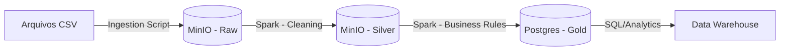

# 🇧🇷 Olist End-to-End Data Pipeline


Um projeto prático de Engenharia de Dados simulando um ambiente de **Lakehouse** local.
O objetivo é ingerir, processar e analisar dados reais do E-commerce brasileiro (Dataset público da Olist), transformando dados brutos em insights de logística e vendas.

---

### 🏗️ Arquitetura da Solução

O projeto segue a arquitetura **Medalhão (Multi-hop)** dentro de um ambiente containerizado:


### 🛠️ Tech Stack
- Linguagem: Python 3.12
- Processamento: Apache Spark (PySpark)
- Armazenamento (Data Lake): MinIO (S3 Compatible) - Buckets: landing-zone, processing-zone
- Armazenamento (Data Warehouse): PostgreSQL
- Infraestrutura: Docker & Docker Compose
- Orquestração: Python Scripts (Pipeline sequencial)

### 🔄 Fluxo de Dados (Pipeline)
- Ingestion (Raw): Upload dos dados brutos (.csv) para o Object Storage simulando um Data Lake (S3).
- Silver Layer: Leitura dos dados brutos, limpeza de tipos de dados (casting de datas), remoção de duplicatas e salvamento em formato colunar otimizado (Parquet).
- Gold Layer (Star Schema):
- Modelagem dimensional (Fatos e Dimensões).
- Criação de KPIs (Ex: Cálculo de Delivery Delay).
- Enriquecimento: Join entre Vendedores e Geolocalização (Lat/Long) para análises espaciais.
- Carga final no Banco Relacional (Postgres).

### 🚀 Como Executar
#### Pré-requisitos
- Docker e Docker Compose instalados.
- Python 3.10+ (Recomendado uso de venv).

### Passo a Passo
#### Clone o repositório:
```
git clone [https://github.com/SEU_USUARIO/lab-engenharia-dados.git](https://github.com/SEU_USUARIO/lab-engenharia-dados.git)
cd lab-engenharia-dados
```
#### Suba a infraestrutura:
```
docker-compose up -d
```
#### Prepare o ambiente Python:
```
python -m venv .venv
source .venv/bin/activate  # Linux/Mac
# .venv\Scripts\activate   # Windows
pip install -r requirements.txt
```
#### Execute o Pipeline:
```
python src/pipeline.py
```
### 📊 Modelagem de Dados (Gold)
O Data Warehouse foi modelado em Star Schema para facilitar análises de BI:

#### Fatos:
- fact_orders: Pedidos, datas e métricas de atraso.
- fact_items: Itens vendidos e valores monetários.

#### Dimensões:
- dim_customers: Dados dos clientes.
- dim_products: Dados dos produtos e categorias.
- dim_sellers: Dados dos vendedores com geolocalização enriquecida.

### 📈 Próximos Passos (Roadmap)
- [x] Ingestão e Processamento Batch (Spark)
- [x] Modelagem Dimensional (Star Schema)
- [x] Enriquecimento de Dados (Geolocalização)
##### Em Breve
- [ ] Dashboards no Metabase 
- [ ] Testes de Qualidade de Dados (Great Expectations)
- [ ] Orquestração com Apache Airflow

##### Desenvolvido por Pedro Vasconcelos [ppedro-vasco] como parte de um laboratório prático de Engenharia de Dados.
